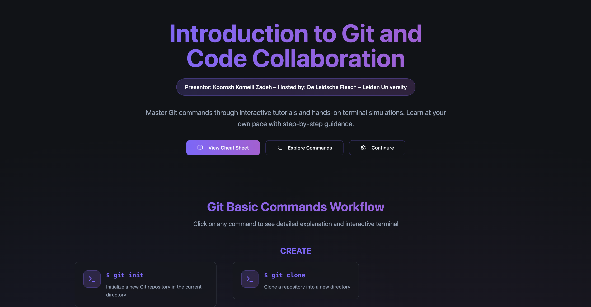
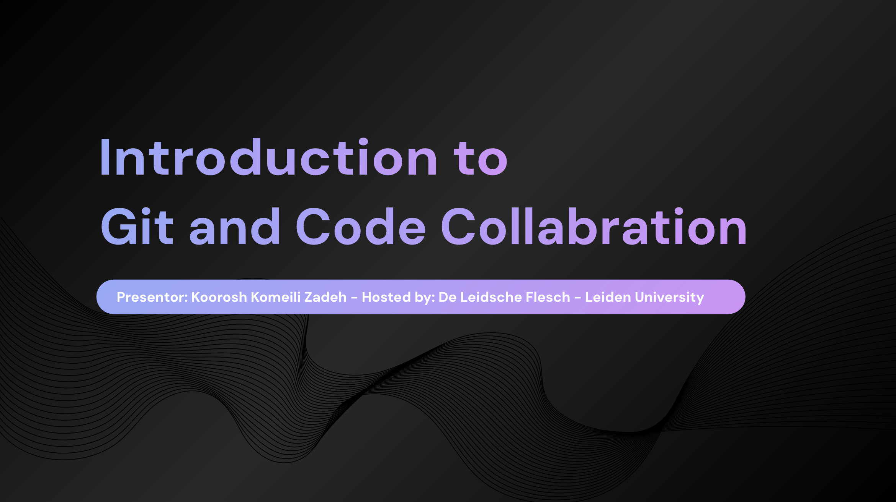

# Introduction to git and code collaboration

## By Koorosh Komeili Zadeh

### Hosted by - Hosted by: De Leidsche Flesch – Leiden University

##### Link to interactive Website:

- [Git tutorial website](https://kooroshkz.github.io/git-tutorial/)

##### Link to the presentation:

- [Git tutorial presentation](https://docs.google.com/presentation/d/198i_YmMi_GB4UjY1I4uAcg864g-V47PAmOAcGR_Suz4/edit?usp=sharing)

#### Thanks to participants and learners!

- [Kooroshkz](https://github.com/kooroshkz) 😜
